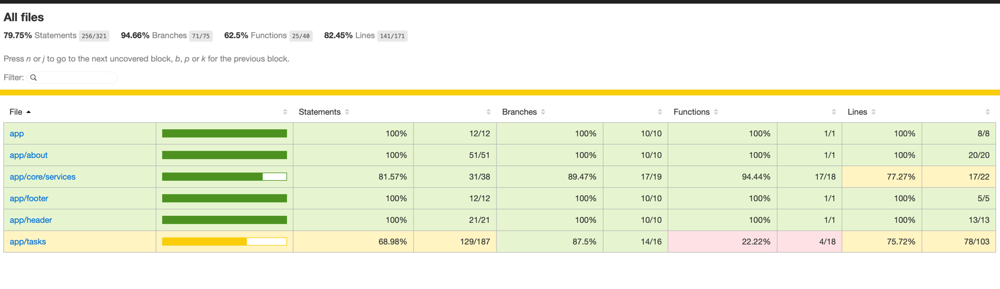

# TaskBoard Pro

Projet du cour Angular Avancé, c'est un petit tableau de tâches construit avec Angular 21 pour apprendre et démontrer l'approche Signal + standalone components.

## Aperçu

TaskBoard Pro est une application simple de gestion de tâches (CRUD léger) avec :

- Création, suppression et modification de tâches
- Gestion de priorité et statut
- Détails de tâche dans une modale
- Composants Angular standalone et utilisation de `signal` pour le state

Ce dépôt sert à la fois de projet éducatif et de base pour des améliorations.

## Technologies

- Angular 21 (standalone components)
- TypeScript
- RxJS
- Bootstrap pour le style
- Tests : configuration par défaut Angular (Karma + Jasmine), et présence de `vitest` dans les dépendances dev

## Prérequis

- Node.js (version compatible avec Angular 21)
- npm (le projet indique `npm@11.7.0` dans le `package.json` — utilisez la version indiquée si possible)

Vérifiez vos versions :

```bash
node -v
npm -v
```

## Installation

Depuis la racine du projet :

```bash
npm install
```

## Commandes utiles

- Lancer l'application en développement (Angular CLI) :

```bash
npm start
# ou
ng serve
```

- Construire pour production :

```bash
npm run build
# ou
ng build --configuration production
```

- Exécuter les tests unitaires (commande par défaut du projet) :

```bash
npm test
# ou
npm run test --coverage #afin de générer le rapport de couverture
# équivalent à `ng test` (Karma + Jasmine) selon la config Angular CLI
```



Remarque : `vitest` est présent dans les dépendances dev mais la commande `test` lance `ng test` par défaut. Selon votre environnement ou runner (IDE), les tests peuvent être exécutés avec Vitest (parfois exposé par certains outils). Voir la section "Tests & problèmes connus" ci‑dessous.

## Structure du projet

Principaux fichiers et dossiers :

```
src/
  app/
    tasks/                # Composant principal des tâches (template, styles, tests)
    core/
      services/task.ts    # Service qui gère les tasks (Signal)
      models/task.model.ts
    header/ footer/ about/ home/
  main.ts
  index.html
angular.json
package.json
README.md
```

## Tests & problèmes connus

1) `ReferenceError: spyOn is not defined`

- Contexte : les tests du projet sont écrits pour Jasmine (utilisant `spyOn`). Si vos tests sont exécutés avec Vitest, l'API globale est `vi` et `spyOn` n'existe pas par défaut.
- Solution incluse : un petit shim a été ajouté dans `src/app/tasks/tasks.spec.ts` qui mappe `spyOn` vers `vi.spyOn` quand Vitest est détecté. Si vous utilisez votre propre runner Vitest, vous pouvez aussi :
  - activer `globals: true` dans la config Vitest et utiliser `vi.spyOn(...)`, ou
  - importer explicitement `import { vi } from 'vitest'` et remplacer `spyOn` par `vi.spyOn`.

2) `NG0100: ExpressionChangedAfterItHasBeenCheckedError`

- Contexte : erreur Angular qui survient en test lorsque le template change une valeur après la première vérification de changement d'état.
- Précaution dans les tests : attendre la stabilisation du fixture entre les actions asynchrones et les assertions :

```ts
fixture.detectChanges();
await fixture.whenStable();
fixture.detectChanges();
```

- Le test `src/app/tasks/tasks.spec.ts` a été adapté pour appeler `fixture.whenStable()` après les interactions qui modifient l'état du composant afin d'éviter cette erreur.

## Bonnes pratiques et suggestions

- Si vous préférez exécuter les tests exclusivement avec Vitest, vous pouvez migrer les specs pour utiliser `vi` au lieu de `spyOn` et configurer Vitest (`globals: true`) pour avoir une expérience proche de Jasmine.
- Tester les interactions DOM via `DebugElement` (`By.css(...)` et `triggerEventHandler`) rend les tests plus robustes et moins dépendants de l'implémentation exacte du DOM.

